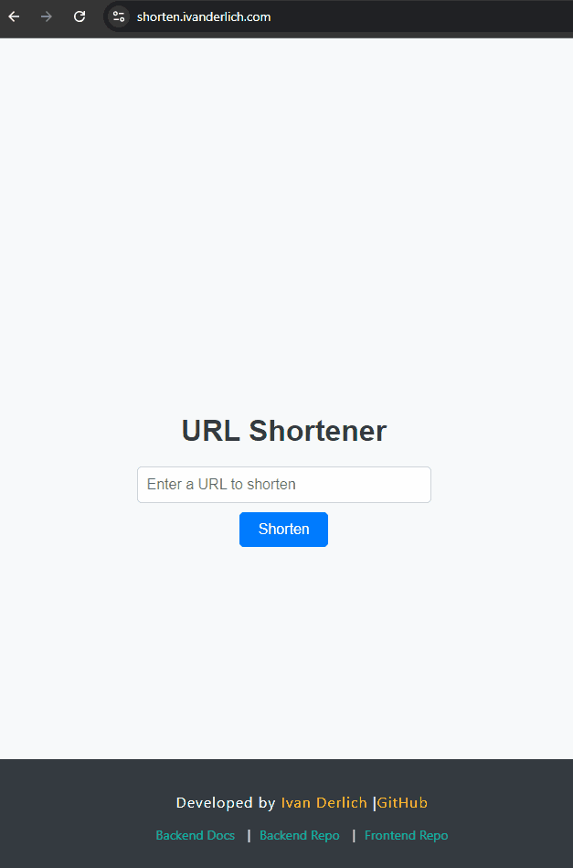

# 🔗 URL Shortener

<p id="description-urlshortener"> A full-stack application that provides an interface for shortening long URLs. Simply paste a link and get a shortened version instantly. <p>

### Example


### API Documentation



## 📦 Installation & Setup

### 1. **Clone the repository**

```bash
git clone https://github.com/IvanDerlich/linkshortener.git
cd linkshortener
```

### 2. **Install System Tools** (if you don't have them installed)

- **Docker CLI** (includes Docker Compose): [https://docs.docker.com/get-docker/](https://docs.docker.com/get-docker/) - Install the CLI tools, not Docker Desktop
- **pnpm**: Follow the official installation guide: [https://pnpm.io/installation](https://pnpm.io/installation)

### 3. **Environment Variables Setup**

You only need to set up environment variables in the **backend folder**. Create a `.env` file in the `back-end` directory.
There's no need to create other .env files in the frontend folder or in the root of the project.
For example:

```bash
# back-end/.env
DATABASE_CONNECTION_STRING=mongodb://localhost:27017/urlshortener
PORT=3000
```

### 4. **Choose your preferred way to run the application:**

## **Option 1: Complete Automated Setup (Recommended)**

```bash
pnpm bootstrap
```

_Sets up the database, installs dependencies, and starts the application_

**Why choose this:** Easiest way to get started, perfect for development

**Performance:** Fast startup, hot reloading for quick iterations

**Requirements:** Just Docker CLI and pnpm installed

## **Option 2: Build and Serve (Production-like)**

```bash
pnpm build-and-serve
```

_Sets up the database, installs dependencies, builds frontend, then serves the application_

**Why choose this:** Test how your app performs in production-like conditions

**Performance:** Optimized build, faster loading, better caching

**Requirements:** Same as Option 1, but takes longer due to build process

## **Option 3: Docker Setup (Containerized)**

```bash
pnpm docker:all
```

_Builds and runs all services in Docker containers_

**Why choose this:** Consistent environment, easy deployment, team collaboration

**Performance:** Slightly slower startup, but identical across all machines

**Requirements:** Docker CLI installed, more disk space

## ⚡ Quick Start Options

For faster startup after initial setup, you can use these quick options:

- **`pnpm start`** - Quickly launches both frontend and backend in development mode with hot reloading for fast iteration

  - _Requires you to have run `pnpm bootstrap` first_

- **`pnpm serve`** - Serves the built frontend application and running backend, optimized for production-like performance

  - _Requires you to have run `pnpm build-and-serve` first_

## **Usage**

Regardless of the method you used to run the application, you can start using it with these endpoints

- **Frontend**: [http://localhost:8080](http://localhost:8080)
- **API Documentation (Swagger)**: [http://localhost:3000/api/](http://localhost:3000/api/)
- **Backend API**: [http://localhost:3000](http://localhost:3000)
- **Database**

```bash
mongosh mongodb://localhost:27017/urlshortener
```

## 🛠️ Tech Stack

<ul id="tech-list-urlshortener">
  <li>Node.js</li>
  <li>Express.js</li>
  <li>React.js</li>
  <li>MongoDB</li>
  <li>Mongoose</li>
  <li>Swagger</li>
  <li>Docker</li>
  <li>Docker Compose</li>
  <li>pnpm (Package Manager)</li>
  <li>Axios</li>
  <li>React Router Dom</li>
</ul>

## Package Management

This project uses **pnpm** (performant npm) instead of npm for several key advantages:

- **🚀 Faster installations** - Up to 2x faster than npm
- **💾 Disk space efficiency** - Saves up to 50% disk space through content-addressable storage
- **🔗 Smart linking** - Uses hard links and symlinks to avoid duplication
- **🏗️ Monorepo support** - Built-in workspace management for frontend and backend
- **🔒 Stricter dependency resolution** - Prevents phantom dependencies

## 🐛 Troubleshooting

If you encounter any issues while setting up or running the application:

📧 **Email**: [a@ivanderlich.com](mailto:a@ivanderlich.com)  
🐛 **Issues**: [https://github.com/IvanDerlich/linkshortener/issues](https://github.com/IvanDerlich/linkshortener/issues)

## 📄 License

This project is licensed under the MIT License - see the [LICENSE](LICENSE) file for details.

## 👨‍💻 Author

**Ivan Derlich - Full Stack Developer**

- 🌐 **Website**: [ivanderlich.com](https://ivanderlich.com)
- 📧 **Email**: [a@ivanderlich.com](mailto:a@ivanderlich.com)
- 💼 **LinkedIn**: [Ivan Derlich](https://linkedin.com/in/ivanderlich)

---

_Built with ❤️ for you_
