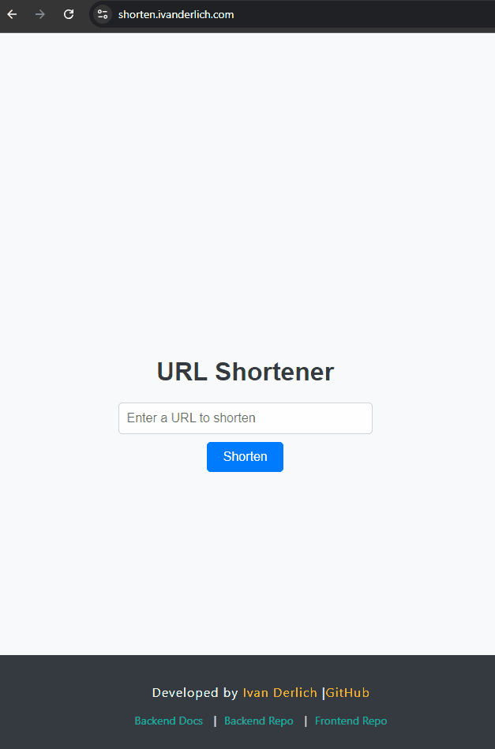

# 🔗 Link Shortener Frontend

A  React application that provides an interface for shortening long URLs. Simply paste a link and get a shortened version instantly.

## ✨ Features

- **URL Shortening**: Convert long URLs into short, manageable links

### Backend Demo



### Frontend Demo


## 🛠️ Tech Stack

- **Frontend Framework**: React 18.3.1
- **HTTP Client**: Axios 1.7.7
- **Routing**: React Router DOM 6.27.0
- **Build Tool**: Create React App
- **Testing**: Jest + React Testing Library
- **Containerization**: Docker

## 📦 Installation & Setup

### Prerequisites

- Node.js (v14 or higher)
- npm or yarn
- Docker (optional, for containerized setup)

### Local Development

1. **Clone the repository**

   ```bash
   git clone https://github.com/IvanDerlich/linkshortener.git
   cd linkshortener/fe
   ```

2. **Install dependencies**

   ```bash
   npm install
   ```

3. **Start the development server**

   ```bash
   npm start
   ```

4. **Access the application**
   Open [http://localhost:8080](http://localhost:8080) in your browser

### Docker Setup

1. **Run with Docker Compose** (from project root)

   ```bash
   docker-compose up --build
   ```

2. **Access the application**
   - Frontend: [http://localhost:8080](http://localhost:8080)
   - Backend: [http://localhost:3000](http://localhost:3000)

## 📜 Available Scripts

- `npm start` - Runs the app in development mode on port 8080
- `npm run build` - Builds the app for production
- `npm run serve` - Serves the production build locally
- `npm run build:serve` - Builds and serves the app
- `npm test` - Launches the test runner

## 🔗 Related Links

- **[Backend Repository](https://github.com/IvanDerlich/linkshortener)** - Node.js backend with MongoDB
- **[Live Application](https://shorten.ivanderlich.com)** - Try the live version

## 👨‍💻 Author

**[Ivan Derlich](https://ivanderlich.com)** - Full Stack Developer

---

_Built with ❤️ using React and modern web technologies_
